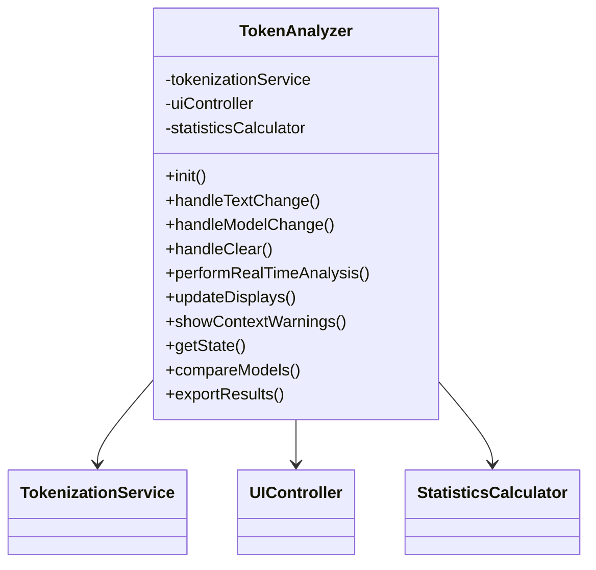
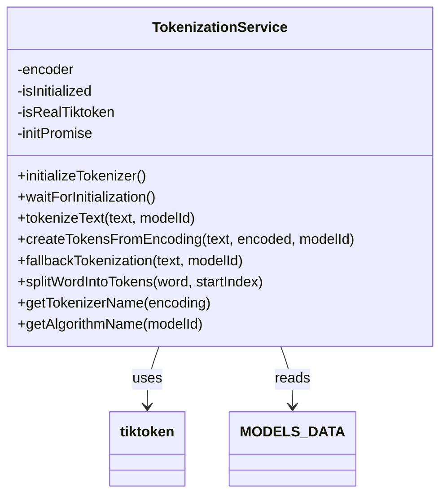
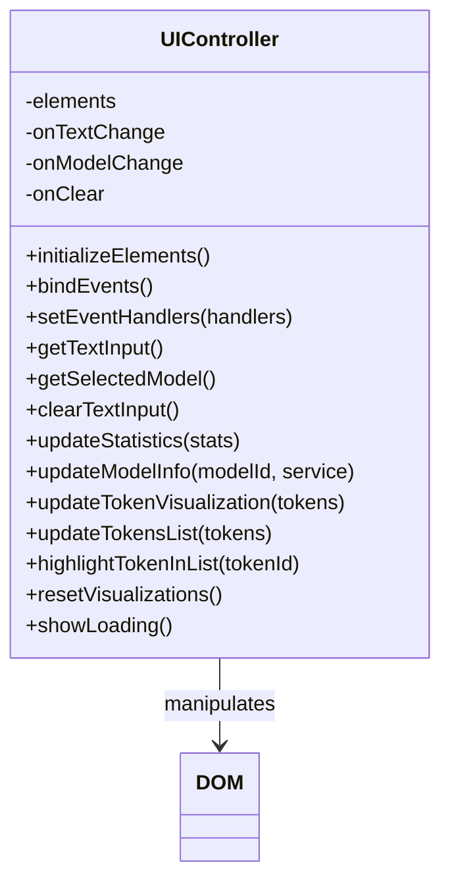
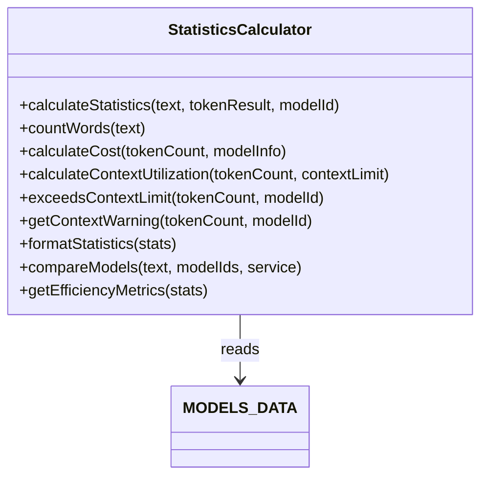

## Component Overview

Tokenizador consists of four main components, each with specific responsibilities:

<CardGroup cols={2}>
  <Card title="TokenAnalyzer" icon="brain" color="#4f46e5">
    **Application orchestrator** that coordinates all other components and manages the application lifecycle
  </Card>
  <Card title="TokenizationService" icon="gears" color="#059669">
    **Tokenization engine** that integrates with tiktoken and provides fallback tokenization
  </Card>
  <Card title="UIController" icon="display" color="#0891b2">
    **UI manager** that handles all DOM manipulation, user input, and visual updates
  </Card>
  <Card title="StatisticsCalculator" icon="calculator" color="#d97706">
    **Computation engine** that calculates metrics, costs, and context utilization
  </Card>
</CardGroup>

---

## TokenAnalyzer

<Icon icon="brain" size={32} />

The **TokenAnalyzer** class is the main application orchestrator. It creates and coordinates all other components, handling the overall application lifecycle and user workflows.

### Responsibilities

- Initialize all services and controllers
- Coordinate communication between components
- Handle user actions (text change, model change, clear)
- Manage error handling and warnings
- Provide export functionality

### Component Diagram



### Key Methods

<AccordionGroup>
  <Accordion title="constructor()" icon="hammer">
    Creates instances of all three core components and calls `init()`.
    
    ```javascript
    constructor() {
        this.tokenizationService = new TokenizationService();
        this.uiController = new UIController();
        this.statisticsCalculator = new StatisticsCalculator();
        this.init();
    }
    ```
  </Accordion>

  <Accordion title="init()" icon="rocket">
    Initializes the application by setting up event handlers and waiting for tiktoken to load.
    
    ```javascript
    async init() {
        // Configure event handlers
        this.uiController.setEventHandlers({
            onTextChange: () => this.handleTextChange(),
            onModelChange: () => this.handleModelChange(),
            onClear: () => this.handleClear()
        });

        // Wait for tiktoken initialization
        await this.tokenizationService.waitForInitialization();

        // Trigger initial model change
        this.uiController.triggerModelChange();
    }
    ```
  </Accordion>

  <Accordion title="performRealTimeAnalysis()" icon="bolt">
    The core analysis workflow that tokenizes text, calculates statistics, and updates the UI.
    
    ```javascript
    async performRealTimeAnalysis() {
        const text = this.uiController.getTextInput().trim();
        const selectedModel = this.uiController.getSelectedModel();

        if (!text) {
            this.resetDisplays();
            return;
        }

        try {
            this.uiController.showLoading();

            // Tokenize text
            const tokenResult = await this.tokenizationService
                .tokenizeText(text, selectedModel);
            
            // Calculate statistics
            const statistics = this.statisticsCalculator
                .calculateStatistics(text, tokenResult, selectedModel);

            // Update UI
            this.updateDisplays(tokenResult, statistics);

            // Check for warnings
            this.showContextWarnings(statistics, selectedModel);
        } catch (error) {
            console.error('Error durante el análisis:', error);
            this.showError('Error al analizar el texto.');
        }
    }
    ```
  </Accordion>

  <Accordion title="compareModels()" icon="code-compare">
    Compares tokenization across multiple models.
    
    ```javascript
    async compareModels(modelIds = ['gpt-4o', 'claude-3.5-sonnet', 'llama-3.1-70b']) {
        const text = this.uiController.getTextInput();
        
        if (!text.trim()) {
            throw new Error('No hay texto para analizar');
        }

        return await this.statisticsCalculator.compareModels(
            text, 
            modelIds, 
            this.tokenizationService
        );
    }
    ```
  </Accordion>

  <Accordion title="exportResults()" icon="download">
    Exports analysis results in JSON, CSV, or TXT format.
    
    ```javascript
    async exportResults(format = 'json') {
        const state = this.getState();
        const text = state.currentText;
        
        if (!text.trim()) {
            throw new Error('No hay datos para exportar');
        }

        const tokenResult = await this.tokenizationService
            .tokenizeText(text, state.selectedModel);
        const statistics = this.statisticsCalculator
            .calculateStatistics(text, tokenResult, state.selectedModel);

        const data = {
            timestamp: new Date().toISOString(),
            model: state.selectedModel,
            text: text,
            statistics: statistics,
            tokens: tokenResult.tokens
        };

        switch (format.toLowerCase()) {
            case 'json':
                return JSON.stringify(data, null, 2);
            case 'csv':
                return this.exportToCSV(data);
            case 'txt':
                return this.exportToText(data);
        }
    }
    ```
  </Accordion>
</AccordionGroup>

### Usage Example

```javascript
// Application initialization (happens automatically on page load)
const app = new TokenAnalyzer();

// Get current application state
const state = app.getState();
console.log(state);
// {
//   currentText: "Hello world",
//   selectedModel: "gpt-4o",
//   isInitialized: true,
//   availableModels: ["gpt-4o", "claude-3.5-sonnet", ...]
// }

// Compare multiple models
const comparison = await app.compareModels([
    'gpt-4o', 
    'claude-3.5-sonnet', 
    'llama-3.1-70b'
]);

// Export results
const jsonData = await app.exportResults('json');
const csvData = await app.exportResults('csv');
```

---

## TokenizationService

<Icon icon="gears" size={32} />

The **TokenizationService** handles all tokenization logic, including integration with the tiktoken library and providing fallback tokenization when tiktoken is unavailable.

### Responsibilities

- Initialize and manage the tiktoken encoder
- Tokenize text using the appropriate encoding
- Create token objects with type classification
- Provide fallback tokenization when tiktoken fails
- Apply model-specific token ratios

### Component Diagram



### Key Methods

<AccordionGroup>
  <Accordion title="initializeTokenizer()" icon="gear">
    Asynchronously loads and initializes the tiktoken library.
    
    ```javascript
    async initializeTokenizer() {
        try {
            // Wait for tiktoken to be available
            let attempts = 0;
            const maxAttempts = 20;
            
            while (attempts < maxAttempts) {
                if (typeof window !== 'undefined' && window.tiktokenLoaded) {
                    break;
                }
                await new Promise(resolve => setTimeout(resolve, 500));
                attempts++;
            }
            
            // Initialize encoder
            let tiktokenLib = tiktoken || window.tiktoken;
            
            if (tiktokenLib && typeof tiktokenLib.get_encoding === 'function') {
                this.encoder = tiktokenLib.get_encoding('cl100k_base');
                this.isInitialized = true;
                this.isRealTiktoken = !window.tiktokenFallback;
                
                console.log(this.isRealTiktoken 
                    ? 'Tiktoken REAL inicializado correctamente' 
                    : 'Tiktoken RESPALDO inicializado correctamente');
            }
        } catch (error) {
            console.error('Error durante la inicialización:', error);
            this.isInitialized = false;
        }
    }
    ```
  </Accordion>

  <Accordion title="tokenizeText()" icon="scissors">
    The main tokenization method that processes text using tiktoken or fallback.
    
    ```javascript
    async tokenizeText(text, modelId) {
        if (!text.trim()) {
            return { tokens: [], count: 0 };
        }

        await this.waitForInitialization();

        const modelInfo = MODELS_DATA[modelId];
        let tokenCount = 0;
        let tokens = [];

        if (this.isInitialized && this.encoder && 
            modelInfo.encoding === 'cl100k_base') {
            try {
                // Use tiktoken for precise tokenization
                const encoded = this.encoder.encode(text);
                tokenCount = encoded.length;
                
                // Apply model-specific ratio
                if (modelInfo.tokenRatio) {
                    tokenCount = Math.round(tokenCount * modelInfo.tokenRatio);
                }

                // Create token objects
                tokens = this.createTokensFromEncoding(text, encoded, modelId);
            } catch (error) {
                console.error('Error de tokenización tiktoken:', error);
                return this.fallbackTokenization(text, modelId);
            }
        } else {
            // Use fallback tokenization
            return this.fallbackTokenization(text, modelId);
        }

        return { tokens, count: tokenCount };
    }
    ```
  </Accordion>

  <Accordion title="createTokensFromEncoding()" icon="puzzle-piece">
    Creates visual token objects from tiktoken encoding with type classification.
    
    ```javascript
    createTokensFromEncoding(text, encoded, modelId) {
        const tokens = [];
        const isApproximate = !this.isRealTiktoken;
        
        for (let i = 0; i < encoded.length; i++) {
            const tokenId = encoded[i];
            const tokenText = this.encoder.decode([tokenId]);
            
            // Classify token type
            let type = 'palabra';
            if (/^\s+$/.test(tokenText)) {
                type = 'espacio_en_blanco';
            } else if (/^\d+$/.test(tokenText.trim())) {
                type = 'number';
            } else if (/^[.,!?;:'"()\[\]{}]+$/.test(tokenText.trim())) {
                type = 'punctuation';
            } else if (tokenText.startsWith(' ')) {
                type = 'palabra_con_espacio';
            } else if (tokenText.length <= 2 && !/^\s+$/.test(tokenText)) {
                type = 'subword';
            }

            tokens.push({
                text: tokenText,
                type: type,
                id: `token_${i}`,
                tokenId: tokenId,
                index: i,
                isApproximate: isApproximate
            });
        }

        return tokens;
    }
    ```
    
    **Token Types:**
    - `palabra` - Regular word token
    - `espacio_en_blanco` - Whitespace
    - `number` - Numeric token
    - `punctuation` - Punctuation mark
    - `palabra_con_espacio` - Word with leading space
    - `subword` - Subword/partial word token
  </Accordion>

  <Accordion title="fallbackTokenization()" icon="life-ring">
    Provides approximate tokenization when tiktoken is unavailable.
    
    ```javascript
    fallbackTokenization(text, modelId) {
        console.log('⚠️ Usando tokenización de respaldo');
        
        const tokens = [];
        let tokenIndex = 0;
        
        // Split into segments
        const segments = text.match(/\S+|\s+/g) || [];
        
        for (const segment of segments) {
            if (/\s/.test(segment)) {
                // Whitespace token
                tokens.push({
                    text: segment,
                    type: 'espacio_en_blanco',
                    id: `token_${tokenIndex}`,
                    tokenId: this.createDeterministicId(segment, tokenIndex),
                    index: tokenIndex,
                    isApproximate: true
                });
                tokenIndex++;
            } else {
                // Split word into tokens
                const wordTokens = this.splitWordIntoTokens(segment, tokenIndex);
                tokens.push(...wordTokens);
                tokenIndex += wordTokens.length;
            }
        }

        return { tokens, count: tokens.length };
    }
    ```
  </Accordion>
</AccordionGroup>

### Token Structure

Each token object returned by the service has this structure:

```typescript
interface Token {
  text: string;           // The actual text of the token
  type: string;           // Token classification (palabra, number, etc.)
  id: string;             // Unique identifier for UI rendering
  tokenId: number;        // Numeric token ID from tiktoken
  index: number;          // Position in token array
  isApproximate: boolean; // Whether this is a real or approximate token
}
```

### Usage Example

```javascript
const service = new TokenizationService();

// Wait for initialization
await service.waitForInitialization();

// Tokenize text
const result = await service.tokenizeText("Hello world", "gpt-4o");
console.log(result);
// {
//   tokens: [
//     { text: "Hello", type: "palabra", id: "token_0", tokenId: 9906, ... },
//     { text: " world", type: "palabra_con_espacio", id: "token_1", tokenId: 1917, ... }
//   ],
//   count: 2
// }

// Get tokenizer name
const tokenizerName = service.getTokenizerName('cl100k_base');
console.log(tokenizerName); // "Tokenizador GPT-4"

// Get algorithm name for a model
const algorithm = service.getAlgorithmName('claude-3.5-sonnet');
console.log(algorithm); // "Tokenización Claude (~20% más tokens)"
```

---

## UIController

<Icon icon="display" size={32} />

The **UIController** manages all user interface interactions, DOM manipulation, and visual updates. It serves as the presentation layer of the application.

### Responsibilities

- Initialize and cache DOM element references
- Handle user input events (keyboard, mouse)
- Update statistics displays
- Render token visualizations
- Manage UI state (loading, empty, error)
- Provide visual feedback (highlighting, scrolling)

### Component Diagram



### Key Methods

<AccordionGroup>
  <Accordion title="initializeElements()" icon="boxes-stacked">
    Caches all DOM element references for performance.
    
    ```javascript
    initializeElements() {
        return {
            textInput: document.getElementById('text-input'),
            modelSelect: document.getElementById('model-select'),
            clearBtn: document.getElementById('clear-btn'),
            tokensContainer: document.getElementById('tokens-container'),
            tokensArray: document.getElementById('tokens-array'),
            modelDetailsLink: document.getElementById('model-details-link'),
            
            // Statistics elements
            tokenCount: document.getElementById('token-count'),
            charCount: document.getElementById('char-count'),
            wordCount: document.getElementById('word-count'),
            costEstimate: document.getElementById('cost-estimate'),
            
            // Model info elements
            selectedModelName: document.getElementById('selected-model-name'),
            contextLimit: document.getElementById('context-limit'),
            tokenizationType: document.getElementById('tokenization-type'),
            costPer1k: document.getElementById('cost-per-1k'),
            activeAlgorithm: document.getElementById('active-algorithm')
        };
    }
    ```
    
    <Note>
      Caching element references improves performance by avoiding repeated DOM queries.
    </Note>
  </Accordion>

  <Accordion title="bindEvents()" icon="link">
    Attaches event listeners to DOM elements.
    
    ```javascript
    bindEvents() {
        // Real-time analysis on input
        if (this.elements.textInput) {
            this.elements.textInput.addEventListener('input', () => {
                this.onTextChange?.();
            });
        }

        // Model selection change
        if (this.elements.modelSelect) {
            this.elements.modelSelect.addEventListener('change', () => {
                this.onModelChange?.();
            });
        }

        // Clear button
        if (this.elements.clearBtn) {
            this.elements.clearBtn.addEventListener('click', () => {
                this.onClear?.();
            });
        }

        // Keyboard shortcuts
        document.addEventListener('keydown', (e) => {
            if (e.ctrlKey && e.key === 'k') {
                e.preventDefault();
                this.elements.textInput?.focus();
            }
        });
    }
    ```
  </Accordion>

  <Accordion title="updateStatistics()" icon="chart-bar">
    Updates all statistics displays with formatted values.
    
    ```javascript
    updateStatistics(stats = {}) {
        const updates = {
            tokenCount: (stats.tokenCount || 0).toLocaleString(),
            charCount: (stats.charCount || 0).toLocaleString(),
            wordCount: (stats.wordCount || 0).toLocaleString(),
            costEstimate: `$${(stats.costEstimate || 0).toFixed(6)}`
        };

        Object.entries(updates).forEach(([key, value]) => {
            if (this.elements[key]) {
                this.elements[key].textContent = value;
            }
        });
    }
    ```
  </Accordion>

  <Accordion title="updateTokenVisualization()" icon="palette">
    Renders color-coded token spans in the main visualization area.
    
    ```javascript
    updateTokenVisualization(tokens = []) {
        if (!this.elements.tokensContainer) return;

        if (!tokens.length) {
            this.elements.tokensContainer.innerHTML = 
                '<p style="color: var(--text-secondary); font-style: italic;">'
                + 'Escribe algo para ver los tokens...</p>';
            return;
        }

        this.elements.tokensContainer.innerHTML = '';
        tokens.forEach(token => {
            const tokenElement = document.createElement('span');
            tokenElement.className = `token ${token.type}`;
            tokenElement.textContent = token.text;
            
            if (token.isApproximate) {
                tokenElement.classList.add('approximate-id');
            }
            
            tokenElement.addEventListener('click', () => {
                this.highlightTokenInList(token.id);
            });

            this.elements.tokensContainer.appendChild(tokenElement);
        });
    }
    ```
  </Accordion>

  <Accordion title="updateTokensList()" icon="list">
    Renders the detailed token list with IDs and types.
    
    ```javascript
    updateTokensList(tokens = []) {
        if (!this.elements.tokensArray) return;

        if (!tokens.length) {
            this.elements.tokensArray.innerHTML = 
                '<p style="color: var(--text-secondary); font-style: italic;">'
                + 'Los tokens aparecerán aquí...</p>';
            return;
        }

        // Check for approximate tokens
        const hasApproximateTokens = tokens.some(token => token.isApproximate);
        
        // Add precision info header
        let headerHtml = '';
        if (hasApproximateTokens) {
            headerHtml = `
                <div class="tokens-precision-info approximate">
                    <i class="fas fa-exclamation-triangle"></i>
                    <span>IDs Aproximados - tiktoken no disponible</span>
                </div>
            `;
        } else {
            headerHtml = `
                <div class="tokens-precision-info accurate">
                    <i class="fas fa-check-circle"></i>
                    <span>IDs Reales de tiktoken</span>
                </div>
            `;
        }

        this.elements.tokensArray.innerHTML = headerHtml;
        
        tokens.forEach((token, index) => {
            const tokenItem = document.createElement('div');
            tokenItem.className = 'token-item';
            tokenItem.id = `token-item-${token.id}`;
            
            const idType = token.isApproximate ? '≈' : '=';
            const idDescription = token.isApproximate ? 'Aproximado' : 'Tiktoken Real';
            
            if (token.isApproximate) {
                tokenItem.classList.add('approximate-token');
            }
            
            tokenItem.innerHTML = `
                <span class="token-text">"${token.text}"</span>
                <span class="token-id">
                    #${index + 1} (${token.type})
                    → ID ${idType} ${token.tokenId} (${idDescription})
                </span>
            `;

            this.elements.tokensArray.appendChild(tokenItem);
        });
    }
    ```
  </Accordion>

  <Accordion title="highlightTokenInList()" icon="highlighter">
    Highlights a specific token in the list and scrolls it into view.
    
    ```javascript
    highlightTokenInList(tokenId) {
        // Remove previous highlights
        document.querySelectorAll('.token-item').forEach(item => {
            item.style.background = '';
            item.style.color = '';
        });

        // Highlight selected token
        const tokenItem = document.getElementById(`token-item-${tokenId}`);
        if (tokenItem) {
            tokenItem.style.background = 'var(--primary-color)';
            tokenItem.style.color = 'white';
            tokenItem.scrollIntoView({ behavior: 'smooth', block: 'center' });
            
            // Remove highlight after 2 seconds
            setTimeout(() => {
                tokenItem.style.background = '';
                tokenItem.style.color = '';
            }, 2000);
        }
    }
    ```
  </Accordion>
</AccordionGroup>

### Event Handler Pattern

The UIController uses a callback pattern for loose coupling:

```javascript
// Set event handlers
uiController.setEventHandlers({
    onTextChange: () => console.log('Text changed'),
    onModelChange: () => console.log('Model changed'),
    onClear: () => console.log('Clear clicked')
});

// Internally, the controller calls these when events occur
this.elements.textInput.addEventListener('input', () => {
    this.onTextChange?.(); // Safe call using optional chaining
});
```

### Usage Example

```javascript
const uiController = new UIController();

// Set event handlers
uiController.setEventHandlers({
    onTextChange: async () => {
        const text = uiController.getTextInput();
        console.log('User typed:', text);
    },
    onModelChange: () => {
        const model = uiController.getSelectedModel();
        console.log('Model changed to:', model);
    },
    onClear: () => {
        console.log('Clear button clicked');
    }
});

// Get user input
const text = uiController.getTextInput();
const model = uiController.getSelectedModel();

// Update displays
uiController.updateStatistics({
    tokenCount: 42,
    charCount: 100,
    wordCount: 15,
    costEstimate: 0.000105
});

// Show loading state
uiController.showLoading();

// Clear input
uiController.clearTextInput();
```

---

## StatisticsCalculator

<Icon icon="calculator" size={32} />

The **StatisticsCalculator** performs all statistical computations including token counts, costs, context utilization, and efficiency metrics.

### Responsibilities

- Calculate comprehensive text statistics
- Estimate API costs based on token counts
- Compute context window utilization
- Generate context limit warnings
- Compare statistics across models
- Calculate efficiency metrics

### Component Diagram



### Key Methods

<AccordionGroup>
  <Accordion title="calculateStatistics()" icon="chart-line">
    Computes all statistics for a given text and model.
    
    ```javascript
    calculateStatistics(text, tokenResult, modelId) {
        const modelInfo = MODELS_DATA[modelId];
        
        if (!modelInfo) {
            throw new Error(`Modelo desconocido: ${modelId}`);
        }

        const tokenCount = tokenResult.count || 0;
        const charCount = text.length;
        const wordCount = this.countWords(text);
        const costEstimate = this.calculateCost(tokenCount, modelInfo);

        return {
            tokenCount,
            charCount,
            wordCount,
            costEstimate,
            contextUtilization: this.calculateContextUtilization(
                tokenCount, 
                modelInfo.contextLimit
            ),
            tokensPerWord: wordCount > 0 ? (tokenCount / wordCount) : 0,
            inputCostPer1M: modelInfo.inputCost,
            outputCostPer1M: modelInfo.outputCost
        };
    }
    ```
    
    **Returns:**
    ```typescript
    {
      tokenCount: number;         // Total tokens
      charCount: number;          // Total characters
      wordCount: number;          // Total words
      costEstimate: number;       // Estimated cost in USD
      contextUtilization: number; // Percentage (0-100)
      tokensPerWord: number;      // Average ratio
      inputCostPer1M: number;     // Cost per 1M input tokens
      outputCostPer1M: number;    // Cost per 1M output tokens
    }
    ```
  </Accordion>

  <Accordion title="calculateCost()" icon="dollar-sign">
    Calculates the estimated API cost based on token count.
    
    ```javascript
    calculateCost(tokenCount, modelInfo) {
        if (!modelInfo || !modelInfo.inputCost) {
            return 0;
        }
        // Calculate cost based on input tokens (cost per 1M tokens)
        return (tokenCount / 1000000) * modelInfo.inputCost;
    }
    ```
    
    <Info>
      Cost calculation uses input pricing since the text being analyzed represents input to the model. Output costs are shown separately for reference.
    </Info>
  </Accordion>

  <Accordion title="calculateContextUtilization()" icon="gauge">
    Computes what percentage of the model's context window is being used.
    
    ```javascript
    calculateContextUtilization(tokenCount, contextLimit) {
        return contextLimit > 0 
            ? Math.min((tokenCount / contextLimit) * 100, 100) 
            : 0;
    }
    ```
  </Accordion>

  <Accordion title="getContextWarning()" icon="triangle-exclamation">
    Returns appropriate warning messages based on context utilization.
    
    ```javascript
    getContextWarning(tokenCount, modelId) {
        const modelInfo = MODELS_DATA[modelId];
        
        if (!modelInfo) return null;

        const utilization = this.calculateContextUtilization(
            tokenCount, 
            modelInfo.contextLimit
        );
        
        if (utilization >= 100) {
            return `⚠️ Texto excede el límite de contexto del modelo `
                + `(${modelInfo.contextLimit.toLocaleString()} tokens)`;
        } else if (utilization >= 90) {
            return `⚠️ Cerca del límite de contexto `
                + `(${utilization.toFixed(1)}% utilizado)`;
        } else if (utilization >= 75) {
            return `ℹ️ Alto uso del contexto `
                + `(${utilization.toFixed(1)}% utilizado)`;
        }
        
        return null;
    }
    ```
    
    **Warning Thresholds:**
    - **100%+**: Critical - exceeds context limit
    - **90-99%**: Warning - approaching limit
    - **75-89%**: Info - high utilization
    - **Under 75%**: No warning
  </Accordion>

  <Accordion title="compareModels()" icon="code-compare">
    Compares statistics across multiple models for the same text.
    
    ```javascript
    async compareModels(text, modelIds, tokenizationService) {
        const comparisons = [];

        for (const modelId of modelIds) {
            try {
                const tokenResult = await tokenizationService
                    .tokenizeText(text, modelId);
                const stats = this.calculateStatistics(
                    text, 
                    tokenResult, 
                    modelId
                );
                
                comparisons.push({
                    modelId,
                    company: MODELS_DATA[modelId]?.company || 'Desconocido',
                    stats,
                    formatted: this.formatStatistics(stats)
                });
            } catch (error) {
                console.warn(`Error comparando modelo ${modelId}:`, error);
            }
        }

        // Sort by cost (cheapest first)
        return comparisons.sort((a, b) => 
            a.stats.costEstimate - b.stats.costEstimate
        );
    }
    ```
  </Accordion>

  <Accordion title="getEfficiencyMetrics()" icon="gauge-high">
    Calculates efficiency metrics for deeper analysis.
    
    ```javascript
    getEfficiencyMetrics(stats) {
        return {
            // Cost per thousand tokens
            costEfficiency: stats.tokenCount > 0 
                ? (stats.costEstimate / stats.tokenCount * 1000) 
                : 0,
            
            // Tokens per character (compression ratio)
            compressionRatio: stats.charCount > 0 
                ? (stats.tokenCount / stats.charCount) 
                : 0,
            
            // Tokens per word (verbosity index)
            verbosityIndex: stats.wordCount > 0 
                ? (stats.tokenCount / stats.wordCount) 
                : 0
        };
    }
    ```
  </Accordion>
</AccordionGroup>

### Statistics Object Structure

A complete statistics object contains:

```typescript
interface Statistics {
  // Basic counts
  tokenCount: number;         // Total tokens in text
  charCount: number;          // Total characters
  wordCount: number;          // Total words
  
  // Cost analysis
  costEstimate: number;       // Estimated cost in USD
  inputCostPer1M: number;     // Input cost per 1M tokens
  outputCostPer1M: number;    // Output cost per 1M tokens
  
  // Context analysis
  contextUtilization: number; // Percentage of context used (0-100)
  tokensPerWord: number;      // Average tokens per word
}
```

### Usage Example

```javascript
const calculator = new StatisticsCalculator();

// Calculate statistics
const stats = calculator.calculateStatistics(
    "Hello world",
    { tokens: [...], count: 2 },
    "gpt-4o"
);

console.log(stats);
// {
//   tokenCount: 2,
//   charCount: 11,
//   wordCount: 2,
//   costEstimate: 0.000005,
//   contextUtilization: 0.0016,
//   tokensPerWord: 1.0,
//   inputCostPer1M: 2.50,
//   outputCostPer1M: 10.00
// }

// Check for warnings
const warning = calculator.getContextWarning(150000, "gpt-4o");
if (warning) {
    console.log(warning); // "⚠️ Cerca del límite de contexto (117.2% utilizado)"
}

// Get efficiency metrics
const efficiency = calculator.getEfficiencyMetrics(stats);
console.log(efficiency);
// {
//   costEfficiency: 0.0025,
//   compressionRatio: 0.182,
//   verbosityIndex: 1.0
// }

// Compare models
const comparison = await calculator.compareModels(
    "Hello world",
    ["gpt-4o", "claude-3.5-sonnet", "llama-3.1-70b"],
    tokenizationService
);

console.log(comparison);
// [
//   { modelId: "llama-3.1-70b", company: "Meta", stats: {...}, ... },
//   { modelId: "gpt-4o", company: "OpenAI", stats: {...}, ... },
//   { modelId: "claude-3.5-sonnet", company: "Anthropic", stats: {...}, ... }
// ]
```

---

## Component Interactions

Here's a comprehensive example showing how all components work together:

```javascript
// 1. Application initialization
class TokenAnalyzer {
    constructor() {
        // Create all components
        this.tokenizationService = new TokenizationService();
        this.uiController = new UIController();
        this.statisticsCalculator = new StatisticsCalculator();
        this.init();
    }

    async init() {
        // 2. Set up event handlers
        this.uiController.setEventHandlers({
            onTextChange: () => this.handleTextChange(),
            onModelChange: () => this.handleModelChange(),
            onClear: () => this.handleClear()
        });

        // 3. Wait for services to initialize
        await this.tokenizationService.waitForInitialization();

        // 4. Trigger initial UI update
        this.uiController.triggerModelChange();
    }

    // 5. Handle user typing
    async handleTextChange() {
        await this.performRealTimeAnalysis();
    }

    // 6. Perform analysis
    async performRealTimeAnalysis() {
        // Get input from UI
        const text = this.uiController.getTextInput();
        const model = this.uiController.getSelectedModel();

        if (!text) return;

        // Tokenize via service
        const tokenResult = await this.tokenizationService
            .tokenizeText(text, model);
        
        // Calculate stats
        const statistics = this.statisticsCalculator
            .calculateStatistics(text, tokenResult, model);

        // Update UI
        this.uiController.updateStatistics(statistics);
        this.uiController.updateTokenVisualization(tokenResult.tokens);
        this.uiController.updateTokensList(tokenResult.tokens);

        // Check warnings
        const warning = this.statisticsCalculator
            .getContextWarning(statistics.tokenCount, model);
        if (warning) {
            console.warn(warning);
        }
    }
}

// 7. Initialize application
const app = new TokenAnalyzer();
```

## Summary

<CardGroup cols={2}>
  <Card title="TokenAnalyzer" icon="brain">
    **Role:** Application Orchestrator
    
    **Key Features:**
    - Coordinates all components
    - Handles user workflows
    - Manages application lifecycle
    - Provides export functionality
  </Card>
  
  <Card title="TokenizationService" icon="gears">
    **Role:** Tokenization Engine
    
    **Key Features:**
    - Integrates with tiktoken
    - Classifies token types
    - Provides fallback tokenization
    - Applies model-specific ratios
  </Card>
  
  <Card title="UIController" icon="display">
    **Role:** Presentation Manager
    
    **Key Features:**
    - Manages DOM interactions
    - Handles user input
    - Updates visualizations
    - Provides visual feedback
  </Card>
  
  <Card title="StatisticsCalculator" icon="calculator">
    **Role:** Computation Engine
    
    **Key Features:**
    - Calculates comprehensive stats
    - Estimates costs
    - Compares models
    - Generates warnings
  </Card>
</CardGroup>

## Next Steps

<CardGroup cols={2}>
  <Card
    title="Architecture Overview"
    icon="sitemap"
    href="/architecture/overview"
  >
    Return to the architecture overview
  </Card>
  <Card
    title="API Reference"
    icon="code"
    href="/api/token-analyzer"
  >
    Explore the complete API documentation
  </Card>
  <Card
    title="How to Use"
    icon="hammer"
    href="/guides/how-to-use"
  >
    Learn how to use the application
  </Card>
  <Card
    title="Contributing"
    icon="users"
    href="https://github.com/alblandino/tokenizador/blob/main/CONTRIBUTING.md"
  >
    Contribute to Tokenizador
  </Card>
</CardGroup>
