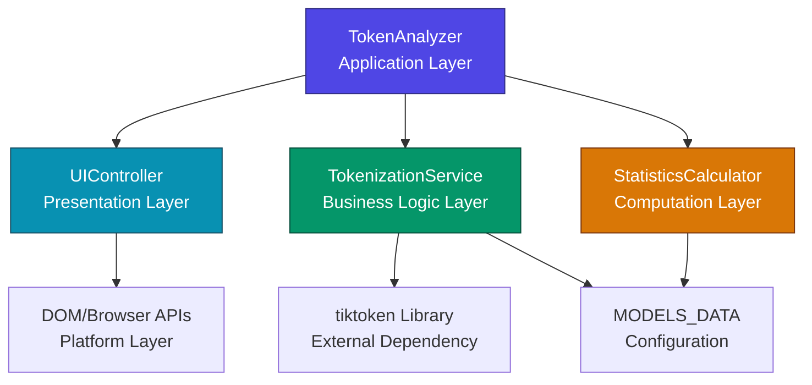
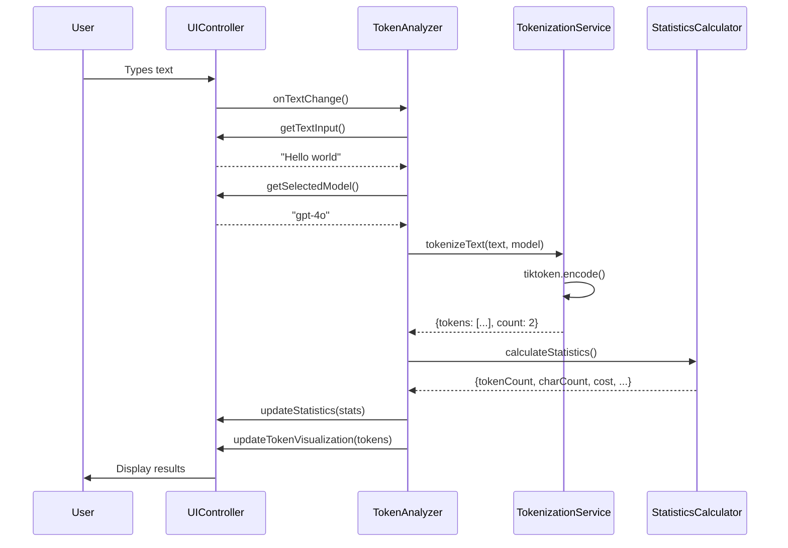
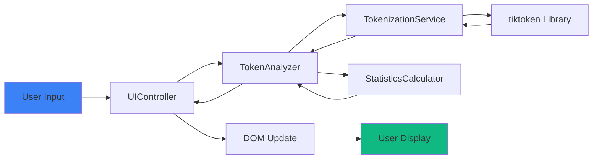

## Architecture Philosophy

Tokenizador is built with a **professional modular architecture** that prioritizes maintainability, testability, and separation of concerns. The application follows object-oriented design principles with clear boundaries between different layers of functionality.

<Note>
  The architecture is designed to be simple yet scalable, using vanilla JavaScript with ES6 classes to avoid framework overhead while maintaining clean code organization.
</Note>

## System Architecture

The application follows a layered architecture pattern with four distinct layers:



## Core Design Principles

<CardGroup cols={2}>
  <Card title="Separation of Concerns" icon="layer-group">
    Each component has a single, well-defined responsibility. The UI layer never directly handles tokenization logic, and services never manipulate the DOM.
  </Card>
  <Card title="Dependency Injection" icon="plug">
    Components receive their dependencies through constructor injection, making the code more testable and flexible.
  </Card>
  <Card title="Event-Driven Communication" icon="bolt">
    The UI layer communicates with the application layer through event handlers, creating loose coupling between components.
  </Card>
  <Card title="Configuration-Driven" icon="gear">
    Model data, encodings, and pricing are centralized in configuration files, making updates easy without code changes.
  </Card>
</CardGroup>

## Project Structure

The codebase is organized into logical directories that reflect the architectural layers:

```
trae/
├── index.html                    # Application entry point
├── styles.css                    # Global styles
├── js/
│   ├── token-analyzer.js         # Application orchestrator (main class)
│   ├── config/
│   │   └── models-config.js      # Model data, encodings, pricing
│   ├── services/
│   │   └── tokenization-service.js  # Tokenization business logic
│   ├── controllers/
│   │   └── ui-controller.js      # UI state and DOM manipulation
│   └── utils/
│       └── statistics-calculator.js # Statistics computation
```

<Accordion title="Why this structure?">
  This structure makes it easy to:
  - **Locate code** - Each file has a clear purpose and location
  - **Test components** - Business logic is isolated from UI concerns
  - **Add features** - New capabilities can be added without modifying existing code
  - **Maintain consistency** - Related code lives together
</Accordion>

## Component Interaction Flow

Here's how the components work together during a typical tokenization operation:



<Steps>
  <Step title="User Input">
    User types text or changes model selection in the browser
  </Step>
  <Step title="Event Handling">
    UIController captures the DOM event and calls the registered event handler
  </Step>
  <Step title="Orchestration">
    TokenAnalyzer coordinates between services to process the request
  </Step>
  <Step title="Business Logic">
    TokenizationService performs the actual tokenization using tiktoken
  </Step>
  <Step title="Calculation">
    StatisticsCalculator computes metrics like cost and context utilization
  </Step>
  <Step title="Display Update">
    UIController updates the DOM with the results
  </Step>
</Steps>

## Data Flow Architecture

Tokenizador uses unidirectional data flow for predictable state management:



<Info>
  **Unidirectional flow** means data always flows in one direction: from user input through processing layers to display output. This makes the application behavior predictable and easier to debug.
</Info>

## Initialization Sequence

When the application starts, components are initialized in a specific order:

```javascript
// From token-analyzer.js:9-15
constructor() {
    this.tokenizationService = new TokenizationService();
    this.uiController = new UIController();
    this.statisticsCalculator = new StatisticsCalculator();
    
    this.init();
}
```

<CodeGroup>
```javascript Step 1: Service Creation
// Create core services
this.tokenizationService = new TokenizationService();
this.uiController = new UIController();
this.statisticsCalculator = new StatisticsCalculator();
```

```javascript Step 2: Event Handler Registration
// Register event handlers with UIController
this.uiController.setEventHandlers({
    onTextChange: () => this.handleTextChange(),
    onModelChange: () => this.handleModelChange(),
    onClear: () => this.handleClear()
});
```

```javascript Step 3: Async Initialization
// Wait for tiktoken library to load
await this.tokenizationService.waitForInitialization();

// Trigger initial UI update
this.uiController.triggerModelChange();
```
</CodeGroup>

## Error Handling Strategy

The architecture includes multiple levels of error handling:

1. **Service Level** - TokenizationService has fallback tokenization when tiktoken fails
2. **Application Level** - TokenAnalyzer catches errors and displays user-friendly messages
3. **UI Level** - UIController validates input and handles DOM errors gracefully

```javascript
// From token-analyzer.js:101-104
try {
    // ... tokenization logic
} catch (error) {
    console.error('Error durante el análisis:', error);
    this.showError('Error al analizar el texto. Por favor, inténtalo de nuevo.');
}
```

<Warning>
  The application never crashes on tokenization errors. If tiktoken fails, the system automatically falls back to approximation-based tokenization.
</Warning>

## State Management

Tokenizador uses a simple state management approach:

- **No global state** - Each component manages its own internal state
- **UI as source of truth** - Form inputs (text, model selection) are the source of truth
- **Computed values** - Statistics and tokens are computed on-demand, not stored

```javascript
// From token-analyzer.js:179-186
getState() {
    return {
        currentText: this.uiController.getTextInput(),
        selectedModel: this.uiController.getSelectedModel(),
        isInitialized: this.tokenizationService.isInitialized,
        availableModels: Object.keys(MODELS_DATA)
    };
}
```

## Extensibility Points

The architecture makes it easy to extend functionality:

<Tabs>
  <Tab title="Add New Model">
    Simply add an entry to `MODELS_DATA` in `models-config.js`. No code changes needed in services or UI.
  </Tab>
  <Tab title="Add New Statistic">
    Extend `StatisticsCalculator.calculateStatistics()` and update the UI to display it.
  </Tab>
  <Tab title="Add New Visualization">
    Add a method to `UIController` and call it from `TokenAnalyzer.updateDisplays()`.
  </Tab>
  <Tab title="Support New Encoding">
    Add the encoding to `MODEL_ENCODINGS` and update `TokenizationService.tokenizeText()`.
  </Tab>
</Tabs>

## Performance Considerations

The architecture includes several performance optimizations:

<CardGroup cols={2}>
  <Card title="DOM Caching" icon="bolt">
    UIController caches DOM element references in `initializeElements()` to avoid repeated queries
  </Card>
  <Card title="Async Operations" icon="clock">
    Tokenization runs asynchronously to avoid blocking the UI thread
  </Card>
  <Card title="Single Responsibility" icon="layer-group">
    Each component does one thing well, avoiding complex computations that could slow down the app
  </Card>
  <Card title="Direct Token Processing" icon="gauge">
    Tokens are processed in a single pass without intermediate storage
  </Card>
</CardGroup>

## Technology Stack

Tokenizador intentionally uses a minimal technology stack:

| Layer | Technology | Why? |
|-------|-----------|------|
| **Core** | Vanilla JavaScript (ES6+) | No build step, no framework overhead |
| **Tokenization** | tiktoken (WASM) | Industry-standard, same as OpenAI uses |
| **Architecture** | ES6 Classes | Clean OOP design without frameworks |
| **UI** | Native DOM APIs | Fast, no virtual DOM overhead |
| **Styling** | CSS Custom Properties | Themeable without preprocessors |

<Tip>
  By avoiding frameworks, Tokenizador loads instantly and has zero runtime dependencies (except tiktoken for tokenization accuracy).
</Tip>

## Next Steps

<CardGroup cols={2}>
  <Card
    title="Component Details"
    icon="puzzle-piece"
    href="/architecture/components"
  >
    Explore each component in detail with code examples
  </Card>
  <Card
    title="API Reference"
    icon="code"
    href="/api/token-analyzer"
  >
    View the complete API documentation
  </Card>
  <Card
    title="How to Use"
    icon="hammer"
    href="/guides/how-to-use"
  >
    Learn how to use Tokenizador
  </Card>
  <Card
    title="Contributing"
    icon="users"
    href="https://github.com/alblandino/tokenizador/blob/main/CONTRIBUTING.md"
  >
    Contribute to the project
  </Card>
</CardGroup>
